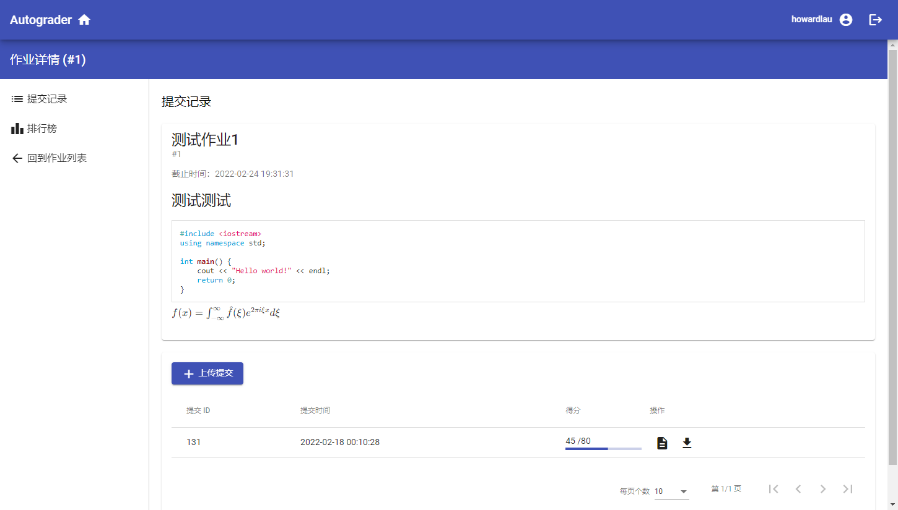
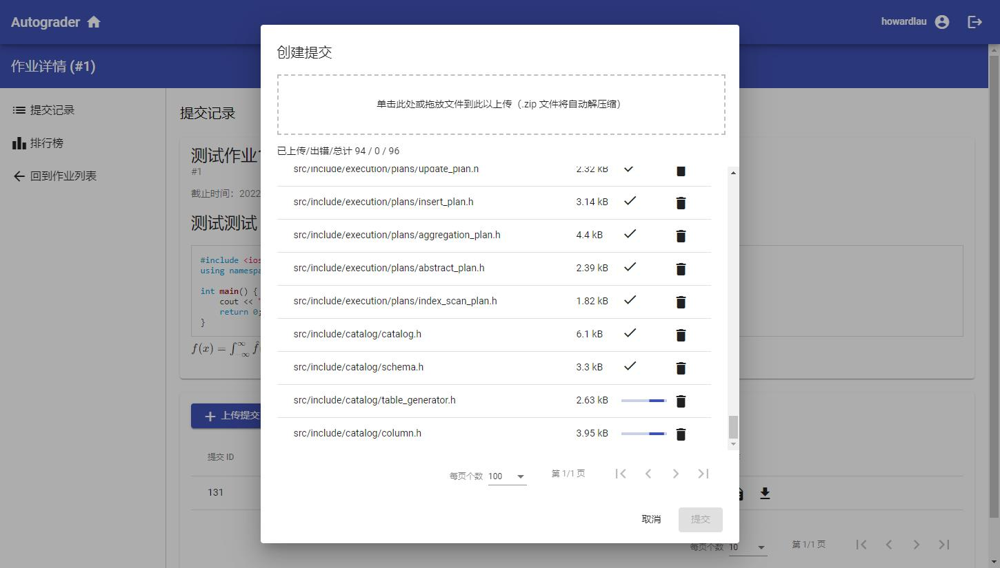
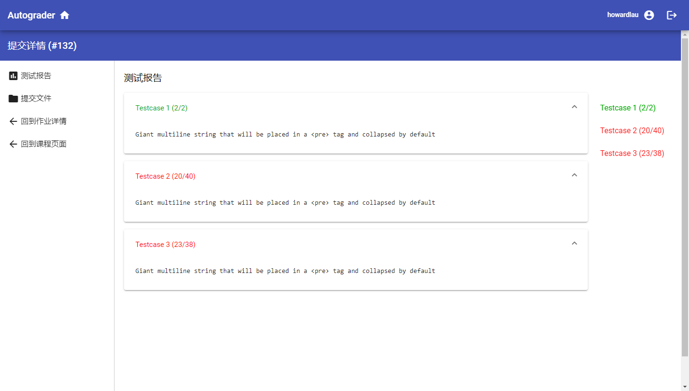
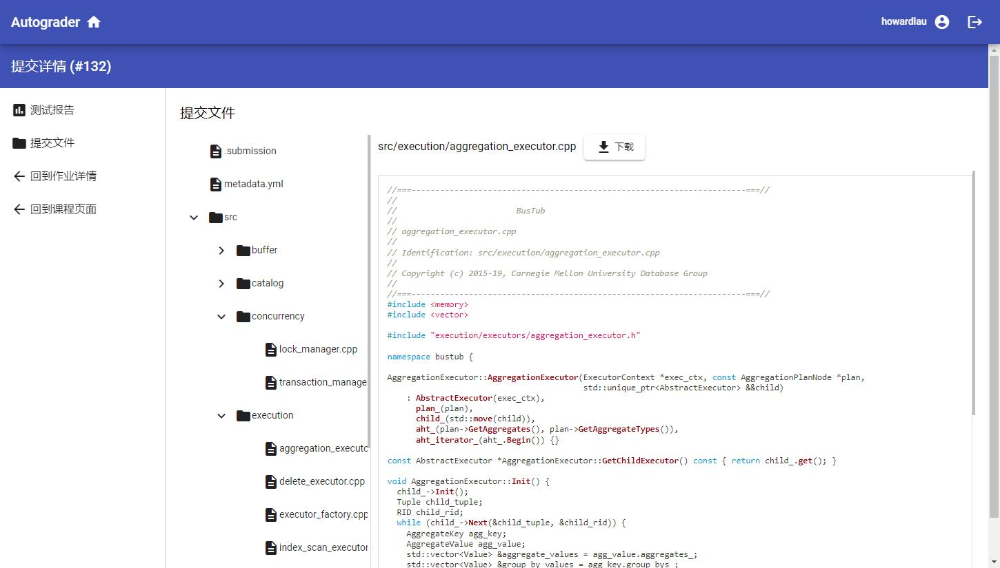

# Autograder 简介

Autograder 是适合用于项目型大作业的自动评分系统。您可以在系统上创建课程、添加作业并设置基于 Docker 技术的自动评分程序。学生可以在网站上提交自己的作业，并获得自动评分程序的反馈。学生可以在一次提交中一次性上传并提交多个文件，无需手动复制粘贴，非常适合项目类型的作业。

Autograder 设计的目标适用于百人级别的课程，且尽量不依赖其他服务，您无需安装并设置复杂的 SQL 数据库和反向代理服务，内部已包含数据库以及 Web GUI。您只需要安装 Docker 并下载运行预编译好的二进制服务器程序，即可向学生提供 Autograder 网页服务。通过 Docker for Windows 技术，Autograder 也可以在 Windows 上运行，方便您试用体验。

## 使用截图预览

在作业详情页面中，用户可以看到作业的详情，以及自己所有的提交记录。点击相应的图标，可以下载提交的所有文件，或者查看报告。

在作业上传页面中，用户可以将自己的作业打包为 `.zip` 文件并上传，也可以手动添加文件。

在测试报告页面中，用户可以看到自己提交记录的测试报告，点击右侧的导航栏可以快速跳转到不同的测试用例详情。

在查看提交文件页面中，用户可以不需要下载整个提交，就可以单独预览提交的文件。