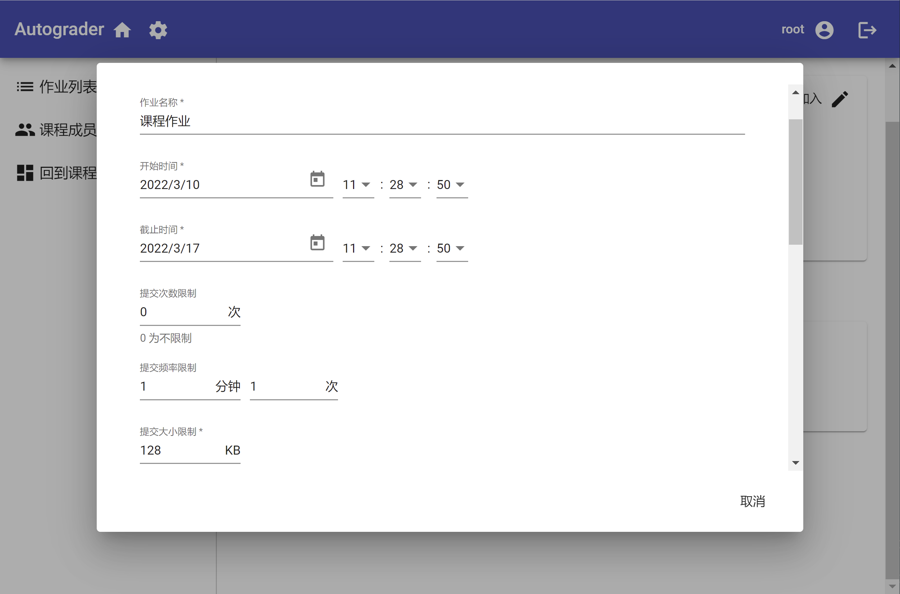
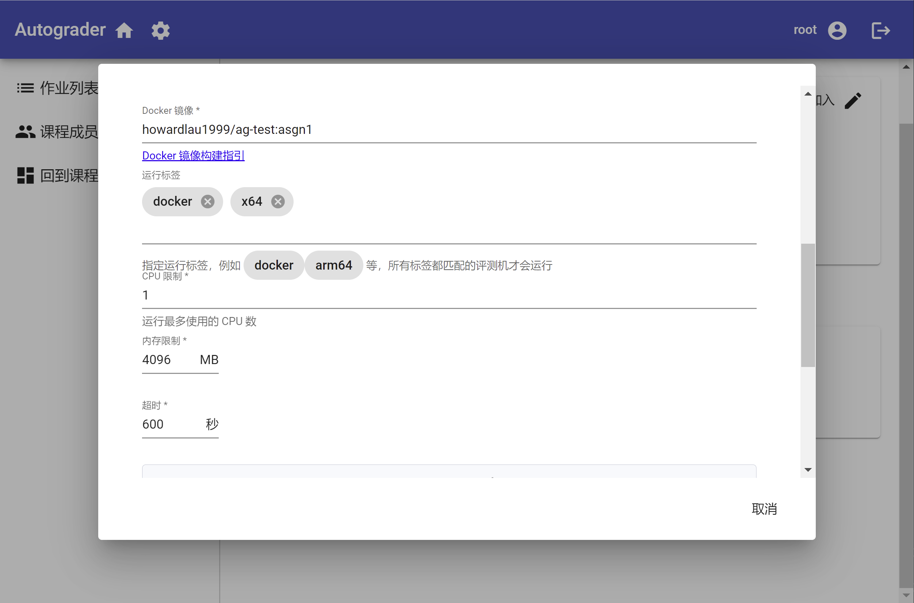
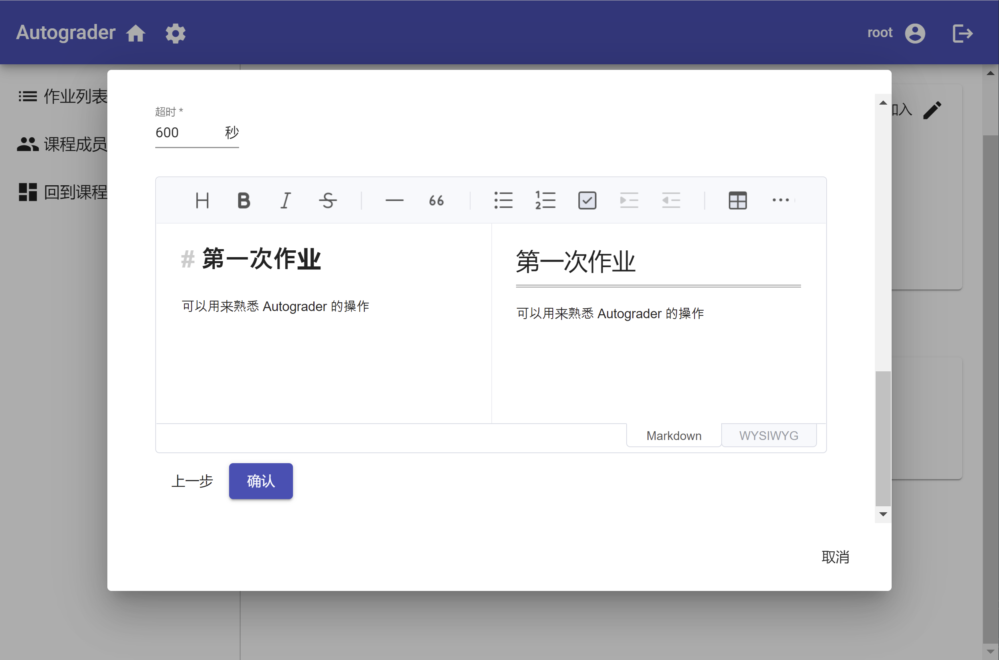
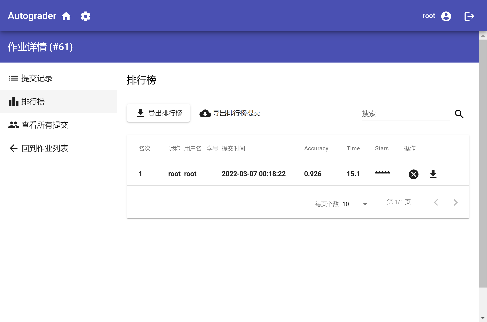
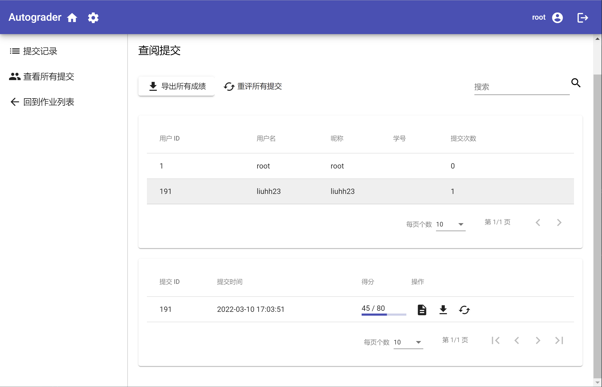

# 作业管理

## 创建作业

点击作业列表中的“添加作业”按钮，可以创建新的作业。

在对话框中，您需要输入作业的名称、提交开始和截止的时间、提交次数、频率、大小限制。其中截止日期不可以早于开始日期。提交次数限制可以设置为 0，也就是不限制。提交频率限制可以按照预计评测时间来设置，避免评测机过载。提交大小可以限制用户提交过大的文件，可以按照作业上传需求和存储空间预算设置。

之后，需要配置评测的 Docker 镜像以及标签、CPU、内存限制。关于如何构建 Docker 镜像以及相应的运行要求，请参考 [Docker 镜像构建指南](./docker-image-specification.md)。运行标签可以根据需要设置，方便调度。例如，如果您的作业需要在 ARM 平台运行，可以设置一个 `arm` 标签，并在运行评测机的时候，同样设置一个 `arm` 标签。通过标签，可以方便的在不同环境下运行不同的作业。一个作业只能对应一组标签。如果需要运行多组标签，请创建多个作业。

只有当作业的标签是评测机标签的子集的时候，作业才会调度到对应的评测机。

最后，可以在 Markdown 编辑器中填写作业描述，之后点击“确认”即可创建作业。

## 排行榜

如果在 Docker 镜像中配置了排行榜输出，可以在有学生提交排行榜成绩后查看排行榜。如果启用了“匿名排行”功能，那么学生将只能看到排行榜分数以及排名，不会显示提交的具体信息。无论是否匿名排行，排行榜中都会加粗显示自己的提交。

如果您是老师或助教，可以对排行榜进行更多的管理操作。对于特定的排行榜成绩，可以点击“取消”按钮，取消成绩，并将其从排行榜中删除。点击“下载”按钮，可以下载对应的提交。

点击“导出排行榜”，可以将排行榜导出为 `.csv` 格式，其中包含了提交的 ID。另外，还可以点击“导出排行榜提交”，打包导出排行榜中的所有提交。

## 提交管理

点击作业详情页面左边的“查看所有提交”按钮，可以打开提交管理局页面。在提交管理页面中，可以看到每个课程成员提交的次数。点击对应的成员，下方将显示课程成员的提交历史。您可以查看提交报告、下载提交或者重评提交。

点击“导出所有成绩”按钮，将导出每一个课程成员的提交次数，以及历史最高分及其对应的提交 ID。