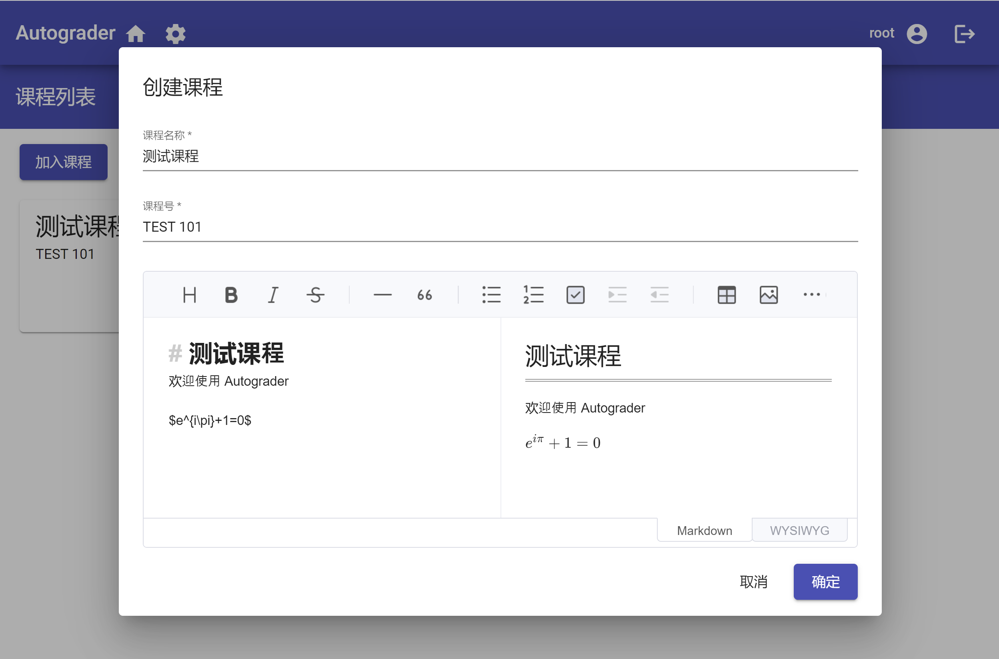
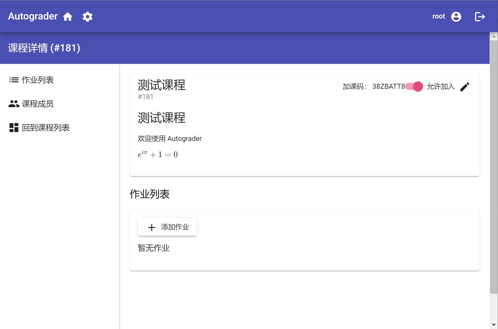
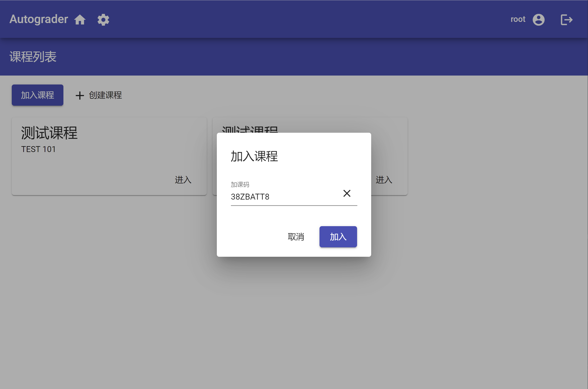
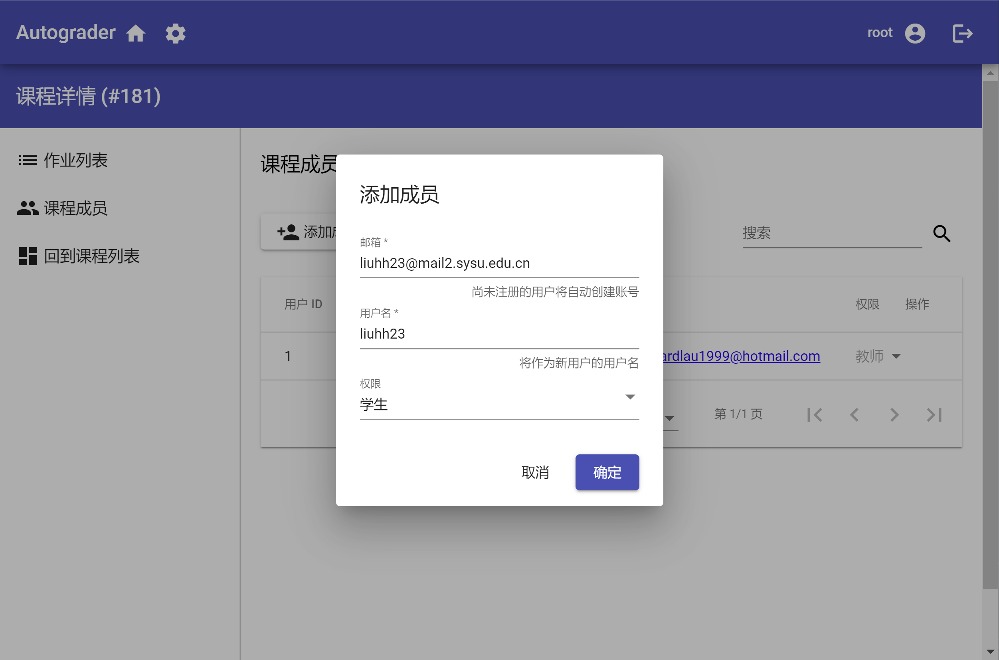
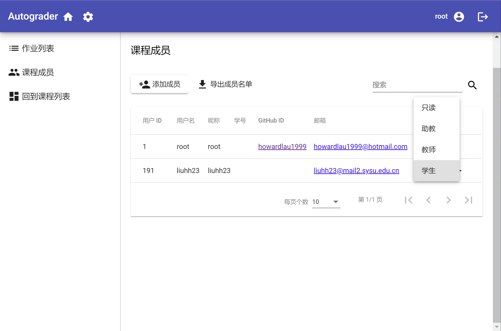
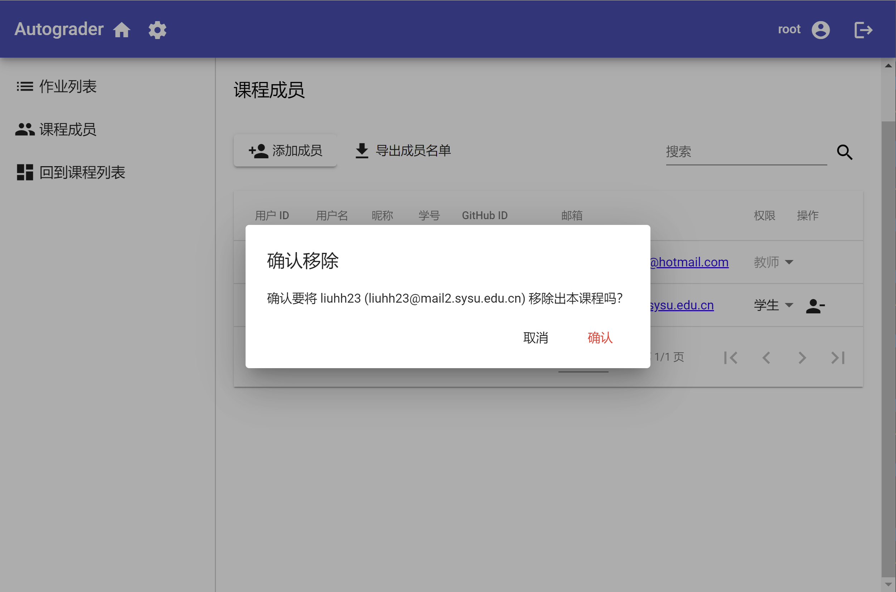

# 课程管理

Autograder 基于课程进行作业以及成员的管理，在添加作业前，需要先创建课程。

## 创建课程

登录后，在主页点击“创建课程”按钮，即可弹出对话框，填写好课程信息后点击“确定”就可以创建课程了。需要注意的是，课程创建后将无法删除。

## 课程详情

创建课程后，点击课程卡片的“进入”按钮，可以跳转到课程详情页面，点击右上角的编辑按钮，可以编辑课程信息。

## 成员管理

在创建课程后，可以通过两种方式添加成员：

1. 生成加课码，用户自行通过加课码加入课程
2. 在成员管理界面添加成员

### 加课码

打开右上角的“允许加入”开关后，会显示本课程的加课码，如果还没有生成，可以点击“生成加课码”生成一个。

之后，用户可以在主页点击“加入课程”按钮，输入生成的加课码，即可加入课程。

### 添加成员

点击“成员管理”按钮，即可进入成员管理页面。点击“添加成员”按钮，可以在弹出的对话框填写用户信息并添加到课程中。

如果对应的邮箱还没有注册，系统将自动为其创建一个新的账号。如果已经注册过，就会直接将对应的用户添加到课程中。

### 修改成员权限

在成员列表中，点击“权限”一列中的下拉菜单，可以修改对应用户的权限。在点击相应的权限后，即会自动生效。您无法修改自己的权限。

### 移除成员

点击“操作”一列中的“移除成员”按钮，可以将对应的成员移除出本课程。需要注意的是，该操作不会删除该成员在本课程中的提交记录，但是会导致无法查询到该成员的提交记录。如果重新添加同样的课程成员，其提交记录将恢复访问。

