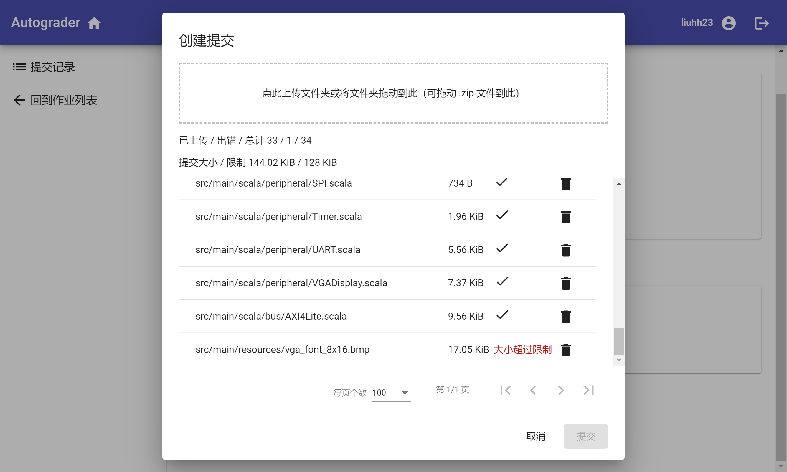
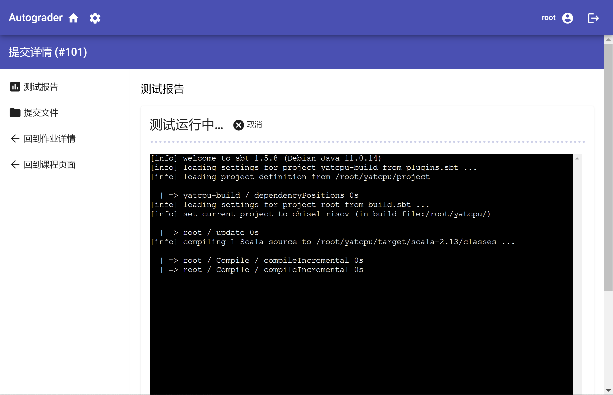
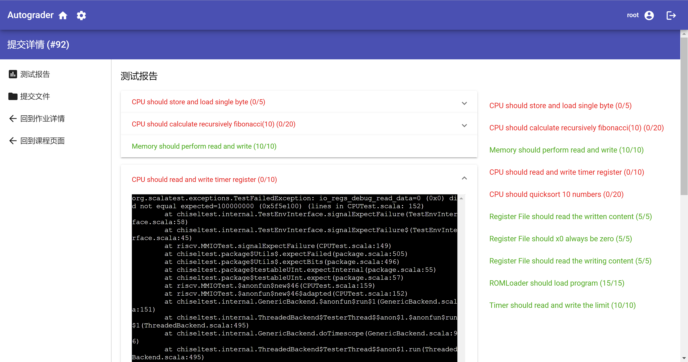
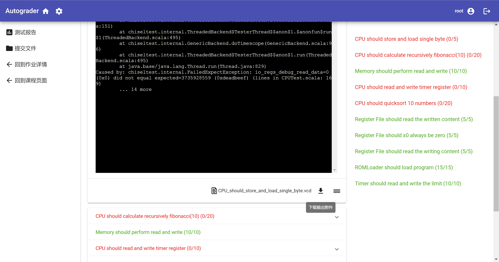
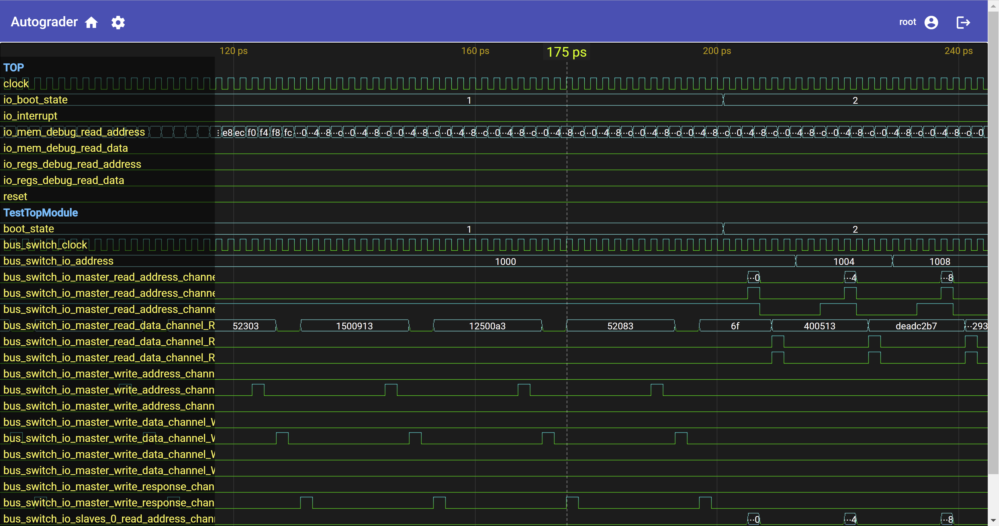
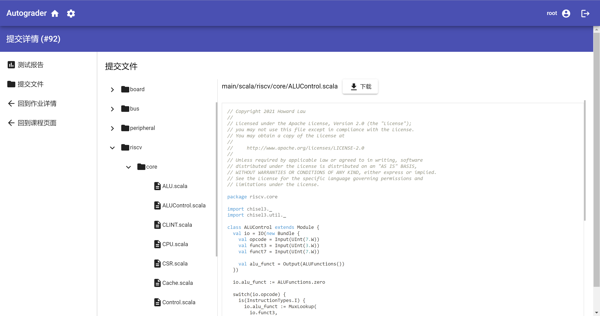

# 提交作业

在创建作业之后，学生就可以看到作业，并在在提交时间内提交作业。

## 上传文件

点击“上传提交”后，将弹出文件上传对话框，用户可以点击虚线方框区域选择文件夹上传，也可以将文件或文件夹拖动到区域内上传。如果拖入的是 `.zip` 文件，则会解压并上传。对话框内会显示文件列表以及每个文件的上传状态，并在列表上方显示统计信息。点击文件的删除按钮，即可以将文件中上传列表中删除。

如果有文件的大小超出了限制，那么该文件将无法上传。当列表中存在上传出错的文件时，无法创建提交，需要手动删除对应的文件后才能上传。

## 查看评测报告

提交创建后，后端服务就会调度评测任务执行。用户可以点击提交列表中的提交，进入评测报告查看页面。

如果评测正在运行中，用户将看到程序的实时输出。

当评测结束后，用户将看到详细的评测报告。点击对应的测试用例，可以展开该用例的相关输出信息。点击右侧的测试用例列表可以快速跳转到对应的测试用例。

如果测试用例含有输出附件，用户可以在底部点击下载按钮下载。如果是 `.vcd` 波形文件，还可以点击预览按钮在线预览波形图。

## 查看提交文件

点击左侧的“提交文件”按钮，可以查阅本次提交上传的文件。如果文件是文本文件、图片或 PDF 文件，则会在右侧显示文件内容预览。用户还可以点击“下载”按钮下载已上传的文件。

